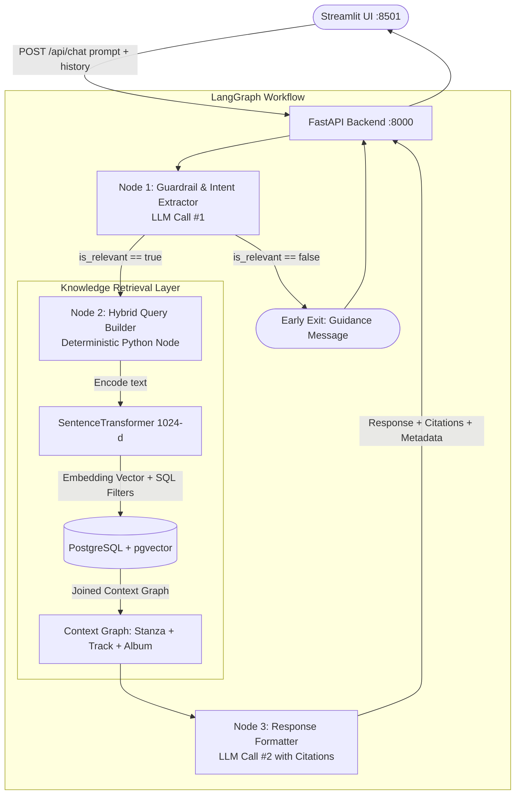

# Data Flow of the DrakeAI Application

This document specifies the end-to-end data flow, agent architecture, and data contracts for the DrakeAI RAG application.

---

## 1. High-Level Flow Steps

1. **Query Entry (Frontend):** The user enters a natural language query into the Streamlit chat interface (running at `http://localhost:8501`).
2. **API Dispatch (Backend):** The frontend dispatches a POST request to the FastAPI backend at `http://localhost:8000/api/chat` carrying the latest `prompt` and conversational `history`.
3. **Context Awareness & Guardrail (Router):** The backend evaluates the query against the domain scope (Drake's discography, albums, and lyrics):
   - **3.1 Out-of-Scope:** If the query is unrelated, the system halts early and returns a domain-specific guidance message:  
     *"I specialize in Drake's discography, albums, and lyrics. Please ask a question related to Drake's music!"*
   - **3.2 In-Scope:** The system extracts structured query intent, semantic themes, and metadata constraints into a typed schema.
4. **Knowledge Retrieval Layer (Hybrid Query Builder):**
   - The backend encodes the semantic query string into a 1024-dimensional dense vector using the workspace embedder (`SentenceTransformer('all-MiniLM-L6-v2')` zero-padded to 1024 dimensions).
   - Executes a parameterized SQL query against PostgreSQL with `pgvector` (`<->` / `<=>`).
   - **4.1 Context Graph Retrieval:** The query performs a multi-table JOIN across `stanza`, `track`, and `album` to retrieve the complete context graph (stanza lyrics, sequential chunk index, personal feel, track metadata, album artwork, and Spotify URLs).
5. **Vetting Agent:**
   - System takes the entire track and determines whether this answers the users query
6. **Response Generation & Attribution:** The retrieved context graph and conversation history are passed to the Response Formatting Agent, which synthesizes a natural response with explicit citations (track title, album, release year, and Spotify links).
7. **Response Delivery:** The structured answer and metadata are returned to the Streamlit UI and appended to `st.session_state.messages`.

---

## 2. Architecture & Orchestration Flow (LangGraph)

The backend pipeline is orchestrated using a **LangGraph State Machine** with a consolidated **2-LLM step** architecture to minimize latency while maintaining strict typing and separation of concerns.



> **Why MCP (Model Context Protocol) is NOT needed:**  
> The agent does not require autonomous, iterative tool execution. Instead, the workflow follows a deterministic state pipeline: LLM #1 extracts structured parameters, a native Python function queries the database directly with strict type safety, and LLM #2 synthesizes the response. Running native async Python database calls eliminates the protocol overhead, latency, and socket complexity of MCP.

---

## 3. Node Specifications & Roles

### Node 1: Guardrail & Intent Extractor (LLM Call #1)
* **Role:** Analyzes user query and conversation history to determine relevance and extract structured search parameters.
* **Mechanism:** Structured Pydantic output (`with_structured_output` or JSON mode).
* **Pydantic Schema:**
  ```json
  {
    "is_relevant": true,
    "rejection_message": null,
    "semantic_query": "heartbreak, vulnerable, longing, late night memories",
    "metadata_filters": {
      "personal_feel": "Late-Night Confessional",
      "release_year_before": 2018,
      "release_year_after": null,
      "album_name": null,
      "album_type": null,
      "limit": 3
    }
  }
  ```
* **Supported `personal_feel` Categories:**
  1. `Late-Night Confessional`
  2. `Triumphant Flex`
  3. `Paranoid & Guarded`
  4. `Time-Stamp Introspection`
  5. `Toxic & Petty`
  6. `Global Groove / Island Infusion`
  7. `Pop Crossover / Radio R&B`
  8. `Hard-Hitting / Mob Tie`
  9. `Crew Loyalty & Brotherhood`
  10. `The Club Anthem`

---

### Node 2: Hybrid Query Builder (Deterministic Python Node)
* **Role:** Converts structured intent into dense embeddings and executes safe, parameterized hybrid search against PostgreSQL without LLM hallucination.
* **Embedding Generation:**
  - Model: `SentenceTransformer('all-MiniLM-L6-v2')`.
  - Padded to 1024 dimensions with zeros (matching `stanza.embedding vector(1024)` in `db/schema.sql`).
* **SQL Query Execution (The Context Graph):**
  Executes a single join query bringing together the entire relational context:
  ```sql
  SELECT 
      s.id AS stanza_id,
      s.lyric_chunk,
      s.chunk_index,
      s.personal_feel,
      1 - (s.embedding <=> :query_vector::vector(1024)) AS similarity,
      t.id AS track_id,
      t.name AS track_name,
      t.disc_number,
      t.external_urls AS track_urls,
      a.id AS album_id,
      a.name AS album_name,
      a.album_type,
      a.release_date,
      a.images_url AS album_art_url
  FROM stanza s
  JOIN track t ON s.song_id = t.id
  JOIN album a ON t.album_id = a.id
  WHERE 1=1
    AND (:personal_feel IS NULL OR s.personal_feel = :personal_feel)
    AND (:release_year_before IS NULL OR EXTRACT(YEAR FROM a.release_date) < :release_year_before)
    AND (:release_year_after IS NULL OR EXTRACT(YEAR FROM a.release_date) > :release_year_after)
    AND (:album_name IS NULL OR a.name ILIKE '%' || :album_name || '%')
    AND (:album_type IS NULL OR a.album_type ILIKE :album_type)
  ORDER BY s.embedding <=> :query_vector::vector(1024) ASC
  LIMIT :limit;
  ```

---

### Node 3: Response Formatter & Citation Agent (LLM Call #2)
* **Role:** Synthesizes the final conversational response based strictly on the retrieved context graph and user query.
* **Attribution Rules:**
  - Explicitly cite Track Name, Album Name, and Release Year for every lyric stanza quoted.
  - Include Spotify links and album artwork metadata for rich frontend rendering.

---

## 4. State & Interface Contracts

### 4.1 Frontend-Backend Contract (`POST /api/chat`)
**Request:**
```json
{
  "prompt": "Show me introspective Drake lyrics from albums released before 2018.",
  "history": [
    {"role": "user", "content": "Hey DrakeAI"},
    {"role": "assistant", "content": "Hey! How can I help you explore Drake's catalog today?"}
  ]
}
```

**Response:**
```json
{
  "response": "Here are introspective lyrics from tracks released prior to 2018...",
  "sources": [
    {
      "track_name": "Passionfruit",
      "album_name": "More Life",
      "release_date": "2017-03-18",
      "album_art_url": "https://i.scdn.co/image/...",
      "spotify_url": "https://open.spotify.com/track/...",
      "quoted_stanzas": [
        "Listen, seeing you got, oh, seeing you got...\nClearing my throat, just to say I'm in town..."
      ]
    }
  ]
}
```

### 4.2 LangGraph Internal State (`AgentState`)
```python
from typing import TypedDict, List, Dict, Any, Optional

class AgentState(TypedDict):
    prompt: str
    history: List[Dict[str, str]]
    is_relevant: bool
    rejection_message: Optional[str]
    semantic_query: Optional[str]
    metadata_filters: Dict[str, Any]
    query_vector: Optional[List[float]]
    retrieved_context: List[Dict[str, Any]]
    final_response: str
    sources: List[Dict[str, Any]]
```

---

## 5. Technology Stack & Tooling

| Component | Technology | Rationale |
|---|---|---|
| **Frontend** | Streamlit (`main.py`) | Rapid chat UI with `st.chat_message` & `st.session_state` |
| **Backend API** | FastAPI + Uvicorn | High-performance asynchronous REST endpoints |
| **Orchestrator** | LangGraph / LangChain | Modular DAG state machine with deterministic Python execution (no MCP overhead) |
| **Data Validation** | Pydantic v2 | Strict JSON schema generation and output validation |
| **Database** | PostgreSQL + `pgvector` | Unified relational catalog and vector similarity index |
| **Embedding Model** | `all-MiniLM-L6-v2` (1024-d padded) | Consistent with data ingestion chunk embeddings |
| **LLM Provider** | Configurable via `.env` | Primary: Local Ollama (e.g. Kimi, Llama 3, Gemma); Fallback: OpenAI / Anthropic / Gemini |


